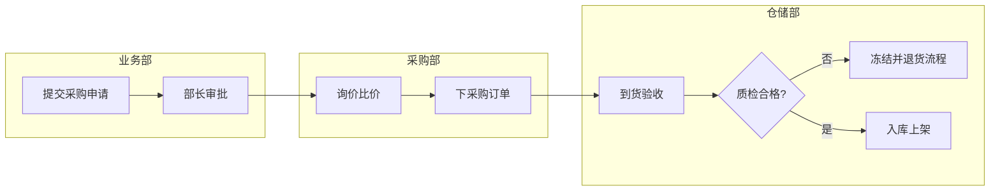

# FDE 技能栈深潜：业务领域知识——两周从门外汉到能和客户专家对答

> 系列专题文 · 支柱三「客户与业务能力」下的单一主题深潜。父级文章见 [FDE 技能栈（三）：客户与业务能力](./2026-09-14-fde-client-business.md)，全景见 [FDE 技能栈全景图](./2026-09-14-fde-skill-stack-pillar.md)。

## 开篇：一个答不上来就丢单的早会

进场第二周，客户运营例会上，甲方副总看着你的原型问了一句："你这个周转率的口径，是含在途的还是不含？我们财务口径和业务口径吵了三年了，你按哪个算的？"

你沉默了五秒钟。这五秒钟里，会议室里所有人对你的定位从"懂我们的技术伙伴"滑回了"外面来的软件 vendor"。后面你再想推任何方案，都要先重新证明自己。

这个场景说明两件事：第一，**领域知识的考核不是笔试，是客户随时抛出的即兴提问**；第二，考核点往往不是高深知识，而是"口径"这种客户内部人人才知道的暗礁。父级文章讲了分层学习法的骨架（术语层、流程层、数据层），本文解决的是更细的问题：每层具体学到什么程度算够、信息从哪里来、怎么验证自己真懂了、以及没有客户可练时怎么练。

---

## 一、先校准目标：什么是"足够危险的流利度"

新人最容易犯的错是把目标定错——要么想学成行业专家（两周不可能），要么觉得"懂个大概就行"（现场必死）。正确的目标我称为"足够危险的流利度"，三条可验证的标准：

1. **不被打断**。客户用本行业术语连续讲十分钟业务，你中途不需要说"这个词什么意思"。注意是"不需要"，不是"不敢"——心里有数但不打断，和听不懂不敢问，是两回事。
2. **能预判**。客户提一个需求，你能立刻反应出它和现有流程、监管要求、数据现状的三个潜在冲突点。这一条是区分"背过名词"和"真懂"的分水岭。
3. **能挑错**。客户给的报表或数据里出现业务上不可能的数值（比如负的在途库存、办结日期早于受理日期），你比客户先发现。

学到什么程度停止？一个很实用的判断：**当你能就某个业务问题提出两种以上互相矛盾的解释，并且知道找谁能仲裁时，这一层就够了**。领域知识学习的边际收益衰减很快，剩下的深度应该在项目推进中按需补，而不是进场前一口气学完。

---

## 二、信息源的优先级地图

两周时间有限，读什么、按什么顺序读，直接决定学习效率。按信息密度排序：

**第一梯队：客户内部的"非官方"材料**

- **历史报表和 Excel 台账**。比任何文档都诚实——这是业务真实在跑的口径。重点看表头的指标名、汇总层级、备注栏里手写的修正说明（"本月不含 XX 分厂"这种备注就是口径证据）。
- **招标需求书（RFP）和需求规格说明书**。含金量最高的一类，客户为了招标被迫把业务痛点、现状系统、期望目标写成了正式文档。进场第一件事就是问"这个项目立项时的材料能不能给我一份"。
- **数据字典和表结构注释**。字段名是术语的金矿，尤其注意两种字段：状态类字段（status 枚举值就是业务流程的骨架）和冗余字段（一个订单表里同时有 `create_time`、`submit_time`、`effective_time`，说明业务上对"订单成立"有不同定义，必有坑）。

**第二梯队：监管与行业公开资料**

- **监管文件**。金融行业读央行、金融监管总局的发文；医疗读卫健委的诊疗规范和医保支付政策；政务读对应条线的国标和部颁规范。不用精读，目的是掌握"哪些事是被监管规定死的"——这决定了你方案的不可触碰边界。
- **上市公司年报的"经营情况讨论与分析"章节**。找客户同行业头部公司的年报，这一章会用规范语言把行业核心流程、核心指标、行业风险讲一遍，是免费的行业速成课。
- **行业标准与国标**。制造业的 GB/T、物流的行标，核心实体定义往往比企业自己的文档严谨。

**第三梯队：行业白皮书和咨询报告**。快速建立全景用，但里面写的是"行业应该什么样"，和客户实际差距可能很大，只作背景，不作依据。

一个原则：**先读客户自己的材料，再读行业通用材料**。顺序反了的后果是你会拿行业的"正确流程"去套客户，而客户现场的流程永远是历史和妥协的产物，套不上。

---

## 三、术语层深化：口径考古

术语表怎么建，父级文章已经讲过（术语、含义、数据来源、确认人四列）。这里展开术语学习中最值钱、也最容易漏的一块：**指标口径考古**。

同一个指标，在客户内部几乎必然存在多个口径。"库存周转率"财务按成本金额算、仓储按件数算、领导 PPT 上用的是一个谁也说不出出处的历史数字。你的任务不是评判谁对，而是**把口径的分歧显性化、文档化**。

做法：术语表升级出一张"指标口径卡"，每个核心指标一张：

```markdown
## 指标口径卡：库存周转率
- 业务定义：一段时期内库存被消耗/周转的次数
- 口径 A（财务部）：销售成本 / 平均库存金额，月频，数据来源 ERP.GL
  - 确认人：财务部 王会计，2026-09-20 当面确认
- 口径 B（仓储部）：出库件数 / 平均在库件数，周频，数据来源 WMS
  - 与 A 的差异：不含在途、冻结库存；金额 vs 件数
- 领导常用值：年报口径，来源不明，**不要在新系统里默认采用**
- 本系统采用：口径 B，理由：数据源稳定、粒度可下钻；已与张部长确认（纪要 09-21）
```

口径确认的关键动作是**用 SQL 把口径算出来给对方看**，而不是口头对齐：

```sql
-- 拿上个月的实际数据，把两种口径各算一遍，差异摆到桌面上
WITH monthly AS (
  SELECT
    date_trunc('month', outbound_date) AS mon,
    SUM(qty)             AS out_qty,
    SUM(qty * unit_cost) AS out_cost
  FROM wms_outbound
  GROUP BY 1
)
SELECT
  mon,
  out_qty  / NULLIF(avg_inv_qty, 0)  AS turnover_by_qty,   -- 仓储口径
  out_cost / NULLIF(avg_inv_cost, 0) AS turnover_by_cost   -- 财务口径
FROM monthly
JOIN inventory_snapshot s ON s.mon = monthly.mon;
```

当两个数字并排放着，业务方自己会意识到"原来我们说的不是一个东西"。这一刻你从学习者变成了帮助他们厘清问题的人——这是领域知识转化为信任的最快路径。

常见坑：**确认口径只问一个人**。正确做法是同一口径至少找两个部门交叉验证，分歧本身就是最重要的发现。

---

## 四、流程层深化：泡现场的操作规程

父级文章说了要 shadowing，这里给具体规程——半天泡现场，按三段走：

**跟（前 1 小时）**：什么都不问，只看。手里拿本子记四样东西：

- 他打开了几个系统、在系统之间切换了几次（切换次数 = 数据孤岛的体感指标）；
- 哪些数据是他手抄或复制粘贴搬运的（搬运点 = 自动化的机会点）；
- 哪些步骤他跳过了 SOP 里的规定（跳过点 = SOP 脱离实际的地方）；
- 他骂了哪句话（原话记下来，比任何需求访谈都真实）。

**问（中间 1 小时）**：挑他告一段落的时候问，用"刚才那一步"开头——"刚才您把单号抄到 Excel 里，是后面谁要用这个表吗？"基于现场观察的提问，得到的答案比会议室访谈具体十倍。避免问"你们流程是什么"这种大词问题，对方会给你背 SOP。

**画（结束后 1 小时内）**：趁记忆新鲜把泳道图画出来，当天发给被观察的人确认。泳道图按角色分泳道，跨泳道的每一条箭头都是一次交接，而**交接点就是错误和延误的高发区，也是系统价值的落点**：



把图画出来发给客户时配一句话："这是我理解的现状，请您挑错。"客户纠正你图上的错误时，是在免费教你业务；而且多数客户从没见过自己业务的完整流程图，这张图本身就是一次小交付。

---

## 五、数据层深化：用数据反推业务

拿到数据权限后，别急着建模型，先做一件事：**用数据检验你前三层学到的一切**。父级文章给过一个验证流程假设的 SQL 例子，这里补一套系统性的"钩稽检查"（reconciliation）——这是审计和财务领域的方法，拿来做业务理解验证极其有效：

1. **总量对账**：核心实体的总数，不同系统之间能不能对上。订单系统在册 12 万单，财务系统有开票记录的 9 万单，差的 3 万是什么？（答案可能是未开票订单、测试数据、或者某个事业部不走财务系统——每种答案都是业务知识。）
2. **状态流转检查**：状态机有没有不可能的流转（已退货的订单又出库）、不可能的时长（审批耗时为负）。
3. **边界值考古**：找极值。金额最大的十笔单、最老的未关闭工单，逐条看明细。异常值背后几乎都有一段业务故事，问出来就是你的领域知识。
4. **空值的业务含义**：一个字段 30% 为空，先别当数据质量问题，问"什么业务情况下这个字段不填"。空值常常对应着一条你没被告诉过的业务分支。

一段可直接套用的 profiling 脚本骨架：

```python
import pandas as pd

def profile_table(df: pd.DataFrame, name: str) -> pd.DataFrame:
    rows = []
    for col in df.columns:
        s = df[col]
        rows.append({
            "table": name,
            "column": col,
            "dtype": str(s.dtype),
            "null_rate": round(s.isna().mean(), 4),
            "nunique": s.nunique(),
            "sample_values": s.dropna().unique()[:5].tolist(),  # 枚举字段直接看取值
        })
    return pd.DataFrame(rows)
```

枚举字段的取值分布是流程的镜子：`status` 字段出现文档里没有的值，说明流程有文档没覆盖的分支。

---

## 六、访谈深化：用关键事件法替代开放式提问

父级文章给了六问提纲。执行中最容易翻车的是第三点"挖痛点"——直接问"有什么痛点"，对方通常给官方答案。更有效的是**关键事件法（Critical Incident Technique）**：不问观点，问具体事件。

- 把"现在什么事最花时间"换成："**上一次**出现严重的 XX 问题是什么时候？当时怎么发现的？谁处理的？处理过程走了几步？"追问一个真实事件的完整链条，你会得到流程、系统、协作方式、责任边界四重信息。
- 把"您想要什么功能"换成："上个月有没有哪次，您想要一个数据但要不到或者等了很久？后来怎么解决的？"

问完后用**回放确认**收口："我复述一遍确认我理解对了：当时先是 A，然后 B，卡在了 C——是这样吗？"这个动作为你赢得两样东西：正确的理解，和"这人做事严谨"的评价。

另外一条纪律：**专家时间按分钟珍惜**。约 30 分钟就不要拖到 45 分钟，问题提前按优先级排序，能在文档里查到的问题绝不上会。你在专家那里的信用额度是消耗品，前期问蠢问题花光了，后面关键问题就约不到人了。

---

## 七、行业速查：常见 FDE 行业的不同打开方式

不同行业的"最短上手路径"不一样，几个高频行业的侧重点：

- **金融（风控/合规方向）**：先学监管语言。央行和金融监管总局的发文口径决定了一切报表格式；核心概念是风险敞口、五级分类、拨备。高压线是数据出域——个人金融信息的合规要求直接决定你的架构。
- **制造（供应链/生产方向）**：先泡车间再开电脑。核心概念 BOM、工单、OEE、MRP；术语陷阱最多（"库存"有六七种）。数据特点是 MES/ERP/WMS 多系统割裂，编码体系不统一是常态。
- **政务**：先学条块结构和审批流程，业务规则大量写在红头文件里而非系统里。核心实体是"事项"和"办件"。注意数据分级分类要求，不确定能不能碰的数据先不碰。
- **医疗**：术语门槛最高（ICD、DRG/DIP、HL7/FHIR），但好消息是标准化程度也高，公开资料质量最好。合规红线是患者隐私，脱敏方案要走在开发前面。
- **能源/公用事业**：OT 与 IT 分离是最大特点，生产网的数据能不能进办公网要先问清楚。时序数据为主，SCADA、点表是绕不开的概念。

通用规律：**每个行业先找"这个行业钱是怎么流动的"，顺着钱能找到所有核心实体和核心指标**。

---

## 八、沉淀与复用：打造你的 Domain Pack

父级文章提过"学完要沉淀"，这里给具体形态。每个项目结束（或阶段结束）时，把领域知识整理成一个 Domain Pack，目录结构固定：

```
domain-pack-<行业>/
├── glossary.md          # 术语表 + 指标口径卡
├── process/             # 泳道图、数据流图（源文件 + 导出图）
├── data-profile.md      # 核心表画像、口径 SQL、已知数据坑
├── regulation-notes.md  # 监管要求摘要、不可触碰边界
└── lessons.md           # 本次踩坑记录：哪些理解错过、怎么纠正的
```

`lessons.md` 是最值钱的一份——记录下"我以为 A 是 B 的意思，实际不是"的每一次纠错。下次接同行业客户，先读这份，能避开 70% 的重复弯路。跨行业换项目时，glossary 和 process 作废，但**钩稽检查的方法、口径考古的方法、关键事件访谈的提纲是通用的**，这是可迁移的元能力。

---

## 九、没有客户时怎么练：自测标准

领域知识能力不是只能在真实客户现场练。三个离线练习：

1. **年报还原练习**。挑一家制造业上市公司，读年报业务章节 + 招股书（招股书的业务章节比年报详细得多），然后画出它的核心业务流程图和核心实体 ER 图。再去对照该公司披露的信息化公告，验证你的理解。两周一个公司，三个公司后你会有体感。
2. **公开数据集口径考古**。拿一份政府公开数据或 Kaggle 上的行业数据集，假装它是"客户给的脏数据"，做完整 profiling + 钩稽检查，写出一份《数据现状评估》。判断标准：你能不能提出三个"只有懂业务才会问"的问题。
3. **口径复述练习**。找一篇行业文章，读完后合上书，用自己的话把三个核心指标的定义、计算口径、业务用途讲出来并录音，回放检查有没有含糊其辞。含糊的地方就是没懂的地方。

进场后的实战自测（对应开篇场景的考核方式）：

- [ ] 客户即兴问"这个指标按哪个口径算的"，我能立刻回答并说出与其他口径的差异
- [ ] 客户连续讲十分钟行业黑话，我不需要打断
- [ ] 我比客户先发现过至少一次报表里的业务异常值
- [ ] 我画的核心流程图被客户纠正过、且纠正后的版本得到了书面确认
- [ ] 我能说出本项目三个"监管/合规上不能这么做"的边界
- [ ] 有客户员工来找我咨询过他们业务上的问题（而不只是系统问题）

最后一条是最硬的指标：当客户开始拿业务问题而不是系统问题来问你时，你的领域知识就算过关了。

---

## 小结

领域知识的学习目标不是"懂行业"，而是**在两周内拿到与客户平等对话的资格**：听得懂黑话、算得清口径、挑得出错。方法可以压缩成一句话——读客户的材料而不是行业的文章，问具体事件而不是抽象观点，用 SQL 验证而不是用耳朵相信。

回到上一层看领域知识与干系人管理、沟通演示如何配合，见父级文章：[FDE 技能栈（三）：客户与业务能力](./2026-09-14-fde-client-business.md)。
