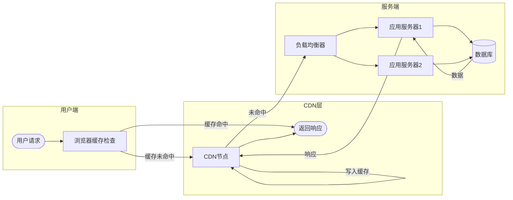
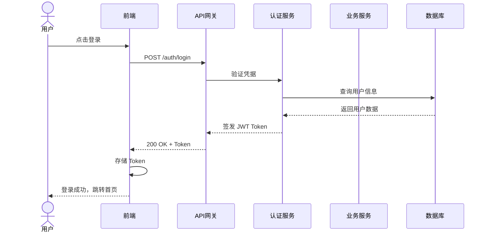
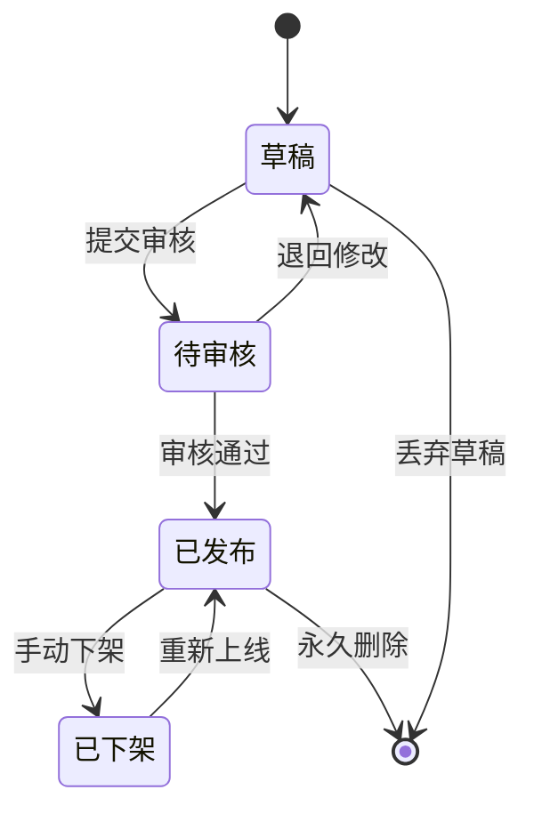
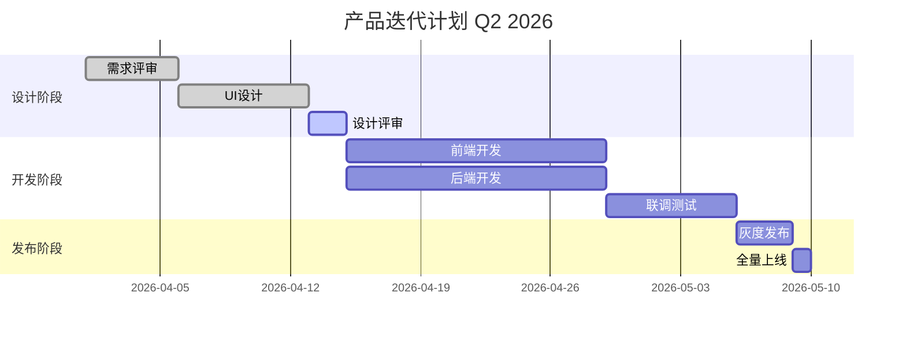
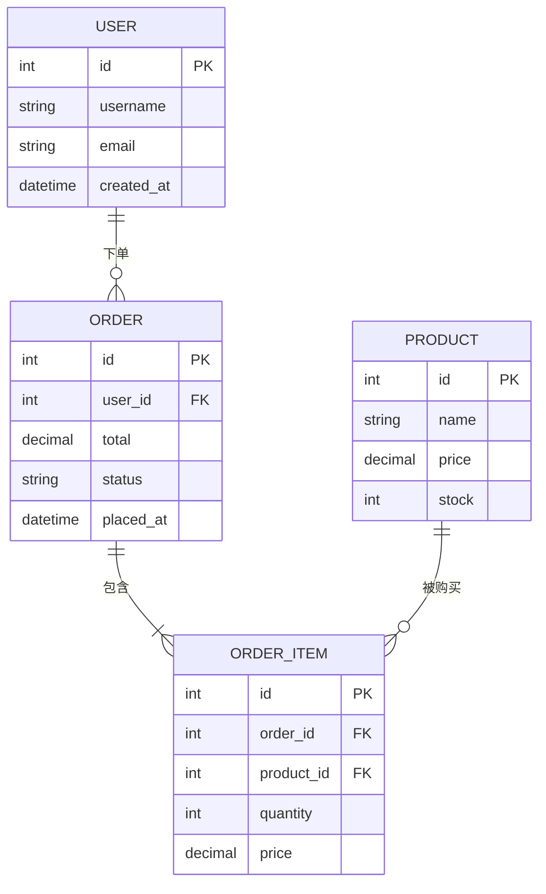
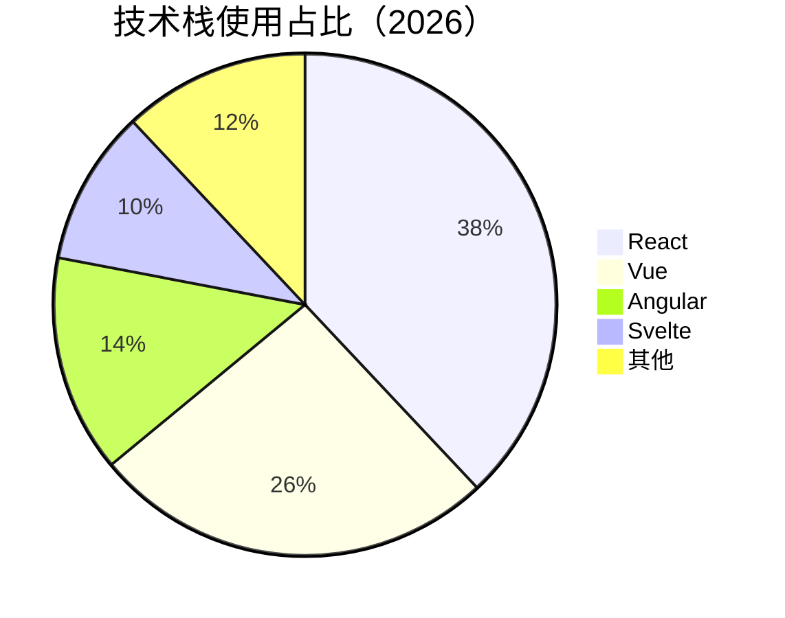

## 前言：核心问题是什么？

在 Hugo 文章中插入流程图、统计图、时序图时，你面对的本质选择是：

```
① 静态图片（PNG/SVG 文件）
② 代码渲染（Mermaid / 纯 CSS / 纯 HTML+JS）
③ 外部服务嵌入（iframe / embed）
```

这三条路没有绝对优劣，**取决于图表的用途、更新频率、交互需求和团队工具链**。本文用系统化的框架帮你做出正确决策，并给出每条路的完整实现代码。

---

## 一、选型决策框架

### 1.1 一张图搞清楚何时用何种方案

```
开始：你的图表需要什么？
│
├─ 需要交互（悬停、缩放、筛选）？
│   ├─ 是 → 【方案C】Chart.js / ECharts / D3.js（JS渲染）
│   └─ 否 ↓
│
├─ 图表数据会频繁更新？
│   ├─ 是 → 【方案B】Mermaid 代码块 或 JS渲染（改代码即改图）
│   └─ 否 ↓
│
├─ 图表结构复杂（精密排版、品牌设计）？
│   ├─ 是 → 【方案A】工具制图后导出 SVG/PNG
│   └─ 否 ↓
│
├─ 简单流程图 / 时序图 / 关系图？
│   └─ 【方案B】Mermaid 代码块（最省力）
│
└─ 简单统计数据（饼图、柱图）？
    └─ 【方案B+C】Mermaid 或 轻量 JS
```

### 1.2 方案对比总表

| 维度 | 静态图片 | Mermaid 代码 | JS 图表库 | 外部嵌入 |
|------|---------|-------------|----------|---------|
| 维护成本 | 高（改图重导出） | 低（改文字即改图） | 中（改数据对象） | 低 |
| 加载性能 | ✅ 最快（预渲染） | 🟡 中（客户端渲染） | 🟡 中（依赖JS库） | ❌ 慢（第三方请求） |
| 交互能力 | ❌ 无 | ❌ 无 | ✅ 丰富 | ✅ 丰富 |
| 版本控制 | ❌ 二进制文件 | ✅ 纯文本 diff | ✅ 纯文本 diff | ❌ 外链 |
| 搜索引擎 | 🟡 alt 文本 | ✅ 代码可索引 | ❌ JS动态 | ❌ |
| 适合场景 | 精美/品牌图 | 逻辑图/流程/时序 | 数据图表 | 复杂外部工具 |

---

## 二、方案 A：静态图片（PNG / SVG）

### 何时选择

- 图表由设计师制作，有精确的品牌颜色和字体
- 图表极少修改（如架构图、固定流程图）
- 需要最快的首屏加载速度
- 图表复杂度远超代码能表达的范围

### 2.1 推荐制图工具

| 工具 | 特点 | 导出格式 | 免费？ |
|------|------|---------|--------|
| **Figma** | 专业设计，矢量精准 | SVG / PNG | 免费基础版 |
| **draw.io（diagrams.net）** | 流程图专用，开源 | SVG / PNG / XML | ✅ 完全免费 |
| **Excalidraw** | 手绘风格，简洁 | SVG / PNG | ✅ 完全免费 |
| **Mermaid Live** | 代码生成后导出 | SVG / PNG | ✅ 完全免费 |
| **Whimsical** | 产品流程图 | PNG | 部分免费 |

### 2.2 Hugo 中的最佳实践

**目录结构：**

```
content/
  posts/
    my-article/
      index.md          ← 文章（Page Bundle 方式）
      flow-chart.svg    ← 和文章同目录
      stats-2026.png
```

**在 Markdown 中引用：**

```markdown
<!-- 普通图片 -->


<!-- 带标题的图片（Hugo shortcode） -->

```

**SVG 直接内联（推荐！避免额外请求）：**

在 Hugo 中可用 shortcode 内联 SVG：

```go-html-template
{{/* layouts/shortcodes/inline-svg.html */}}
{{ $svg := .Get 0 }}
{{ $file := .Page.Resources.Get $svg }}
{{ if $file }}
  {{ $file.Content | safeHTML }}
{{ end }}
```

```markdown

```

### 2.3 SVG 优于 PNG 的理由

```html
<!-- SVG：矢量，任意分辨率清晰，文件小，可用 CSS 控制颜色 -->


<!-- 暗色模式下反转 SVG 颜色（纯 CSS） -->
<style>
@media (prefers-color-scheme: dark) {
  img[src$=".svg"] {
    filter: invert(1) hue-rotate(180deg);
  }
}
</style>
```

---

## 三、方案 B：Mermaid 代码渲染

Mermaid 是目前**性价比最高**的图表方案：用类 Markdown 的代码描述图，浏览器自动渲染为 SVG。

### 3.1 在 Hugo 中启用 Mermaid

**`hugo.toml` 配置：**

```toml
[markup.goldmark.renderer]
  unsafe = true   # 允许 HTML 渲染（Mermaid 需要）
```

**方法一：全局引入（在 `layouts/_default/baseof.html` 的 `</body>` 前）**

```html
<script type="module">
  import mermaid from 'https://cdn.jsdelivr.net/npm/mermaid@11/dist/mermaid.esm.min.mjs';
  mermaid.initialize({
    startOnLoad: true,
    theme: document.documentElement.dataset.theme === 'dark' ? 'dark' : 'default',
    flowchart: { useMaxWidth: true, htmlLabels: true },
    securityLevel: 'loose'
  });
</script>
```

**方法二：Hugo Shortcode（按需加载，推荐）**

创建 `layouts/shortcodes/mermaid.html`：

```html
<div class="mermaid-wrap">
  <div class="mermaid">{{ .Inner }}</div>
</div>

{{- if not (.Page.Scratch.Get "mermaid") -}}
  {{- .Page.Scratch.Set "mermaid" true -}}
  <script type="module">
    import mermaid from 'https://cdn.jsdelivr.net/npm/mermaid@11/dist/mermaid.esm.min.mjs';
    mermaid.initialize({ startOnLoad: true, theme: 'default' });
  </script>
{{- end -}}
```

在文章中使用：

```markdown

flowchart TD
    A[开始] --> B{判断条件}
    B -->|是| C[执行操作A]
    B -->|否| D[执行操作B]
    C --> E[结束]
    D --> E

```

---

### 3.2 流程图（Flowchart）



**代码：**

```text
flowchart LR
    subgraph 用户端
        A([用户请求]) --> B[浏览器缓存检查]
    end
    subgraph CDN层
        B -->|缓存未命中| C[CDN节点]
        B -->|缓存命中| Z([返回响应])
    end
    subgraph 服务端
        C -->|未命中| D[负载均衡器]
        D --> E[应用服务器1]
        D --> F[应用服务器2]
        E --> G[(数据库)]
        F --> G
    end
    G --> E --> C --> Z
```

---

### 3.3 时序图（Sequence Diagram）



**代码：**

```text
sequenceDiagram
    actor 用户
    participant 前端
    participant API网关
    participant 认证服务
    participant 数据库

    用户->>前端: 点击登录
    前端->>API网关: POST /auth/login
    API网关->>认证服务: 验证凭据
    认证服务->>数据库: 查询用户信息
    数据库-->>认证服务: 返回用户数据
    认证服务-->>API网关: 签发 JWT Token
    API网关-->>前端: 200 OK + Token
    前端-->>用户: 登录成功
```

---

### 3.4 状态图（State Diagram）



---

### 3.5 甘特图（Gantt）



---

### 3.6 ER 图（实体关系图）



---

### 3.7 饼图 / XY 图表（Mermaid v11+）



```mermaid
xychart-beta
    title "月活用户增长（万人）"
    x-axis [1月, 2月, 3月, 4月, 5月, 6月]
    y-axis "月活（万）" 0 --> 200
    bar  [80, 95, 110, 130, 158, 185]
    line [80, 95, 110, 130, 158, 185]
```

---

## 四、方案 C：JavaScript 图表库

当需要**交互性**或**复杂统计图**时，JS 库是唯一选择。

### 4.1 主流库选型

| 库 | 体积 | 特点 | 最适合 |
|----|------|------|--------|
| **Chart.js** | ~60KB | 上手快，文档完善 | 常规统计图 |
| **ECharts** | ~800KB（按需~100KB） | 功能最全，中文友好 | 复杂数据大屏 |
| **D3.js** | ~280KB | 底层，完全自定义 | 定制化高度 |
| **Recharts** | React专用 | 组件化，声明式 | React 项目 |
| **Observable Plot** | ~300KB | 现代API，简洁 | 数据探索 |

### 4.2 Hugo Shortcode 封装 Chart.js

**创建 `layouts/shortcodes/chart.html`：**

```html
{{ $id := printf "chart-%s" (now.UnixNano | string) }}
{{ $type := .Get "type" | default "bar" }}
{{ $title := .Get "title" | default "" }}

<div class="chart-container" style="position:relative; max-width:700px; margin:2rem auto;">
  {{ if $title }}<p class="chart-title">{{ $title }}</p>{{ end }}
  <canvas id="{{ $id }}"></canvas>
</div>

<script>
(function() {
  const data = {{ .Inner | safeJS }};

  function initChart() {
    const ctx = document.getElementById('{{ $id }}');
    if (!ctx || !window.Chart) return;
    new Chart(ctx, {
      type: '{{ $type }}',
      data: data,
      options: {
        responsive: true,
        plugins: {
          legend: { position: 'top' }
        }
      }
    });
  }

  if (window.Chart) {
    initChart();
  } else {
    const s = document.createElement('script');
    s.src = 'https://cdn.jsdelivr.net/npm/chart.js@4/dist/chart.umd.min.js';
    s.onload = initChart;
    document.head.appendChild(s);
  }
})();
</script>
```

**在文章中使用：**

```markdown

{
  "labels": ["1月", "2月", "3月"],
  "datasets": [
    {
      "label": "自然搜索",
      "data": [1200, 1900, 2400],
      "backgroundColor": "rgba(59,130,246,0.7)"
    },
    {
      "label": "付费广告",
      "data": [800, 1100, 1600],
      "backgroundColor": "rgba(16,185,129,0.7)"
    }
  ]
}

```

---

### 4.3 ECharts 完整示例（直接在 HTML 中）

在 Hugo 文章的 raw HTML 块中，或通过 shortcode 注入：

```html
<div id="echarts-demo" style="width:100%;height:400px;"></div>
<script src="https://cdn.jsdelivr.net/npm/echarts@5/dist/echarts.min.js"></script>
<script>
const chart = echarts.init(document.getElementById('echarts-demo'), null, {
  renderer: 'svg'  // SVG渲染，清晰且可缩放
});

chart.setOption({
  tooltip: { trigger: 'axis' },
  legend: { data: ['注册用户', '活跃用户', '付费用户'] },
  xAxis: {
    type: 'category',
    data: ['2025-Q3', '2025-Q4', '2026-Q1', '2026-Q2']
  },
  yAxis: { type: 'value', name: '用户数（万）' },
  series: [
    {
      name: '注册用户',
      type: 'line',
      smooth: true,
      data: [120, 145, 180, 215],
      areaStyle: { opacity: 0.1 }
    },
    {
      name: '活跃用户',
      type: 'line',
      smooth: true,
      data: [80, 98, 125, 158]
    },
    {
      name: '付费用户',
      type: 'bar',
      data: [12, 18, 26, 35]
    }
  ]
});

// 响应窗口大小变化
window.addEventListener('resize', () => chart.resize());
</script>
```

---

## 五、方案 D：纯 CSS / SVG 手写（特殊场景）

对于**简单且追求极致性能**的图表，纯 CSS 无需任何 JS：

### 5.1 纯 CSS 柱状图

```html
<div class="css-bar-chart" aria-label="季度收入对比">
  <style>
  .css-bar-chart {
    display: flex;
    align-items: flex-end;
    gap: 1.5rem;
    height: 200px;
    padding: 1rem;
    border-bottom: 2px solid #e2e8f0;
  }
  .css-bar {
    flex: 1;
    background: linear-gradient(to top, #3b82f6, #93c5fd);
    border-radius: 4px 4px 0 0;
    position: relative;
    transition: opacity 0.2s;
    animation: barGrow 0.8s cubic-bezier(0.34, 1.56, 0.64, 1) both;
    transform-origin: bottom;
  }
  .css-bar:hover { opacity: 0.8; }
  .css-bar::after {
    content: attr(data-value);
    position: absolute;
    top: -1.5rem;
    left: 50%;
    transform: translateX(-50%);
    font-size: 0.75rem;
    font-weight: 600;
    color: #1e40af;
    white-space: nowrap;
  }
  .css-bar::before {
    content: attr(data-label);
    position: absolute;
    bottom: -1.5rem;
    left: 50%;
    transform: translateX(-50%);
    font-size: 0.75rem;
    color: #64748b;
    white-space: nowrap;
  }
  @keyframes barGrow {
    from { transform: scaleY(0); }
    to   { transform: scaleY(1); }
  }
  </style>

  <div class="css-bar" style="height:60%" data-value="120万" data-label="Q1"></div>
  <div class="css-bar" style="height:75%" data-value="150万" data-label="Q2"></div>
  <div class="css-bar" style="height:88%" data-value="176万" data-label="Q3"></div>
  <div class="css-bar" style="height:100%" data-value="200万" data-label="Q4"></div>
</div>
```

### 5.2 内联 SVG 流程图

SVG 是**最优的静态矢量图方案**，可直接写在 Markdown 的 HTML 块中，也可从 draw.io 导出：

```html
<svg viewBox="0 0 600 200" xmlns="http://www.w3.org/2000/svg"
     role="img" aria-label="三步流程图">
  <defs>
    <marker id="arr" markerWidth="8" markerHeight="8"
            refX="6" refY="3" orient="auto">
      <path d="M0,0 L0,6 L8,3 z" fill="#64748b"/>
    </marker>
  </defs>

  <!-- 步骤1 -->
  <rect x="20" y="70" width="140" height="60"
        rx="8" fill="#dbeafe" stroke="#3b82f6" stroke-width="2"/>
  <text x="90" y="97" text-anchor="middle"
        font-family="sans-serif" font-size="14" fill="#1e40af">
    <tspan x="90" dy="0" font-weight="600">步骤一</tspan>
    <tspan x="90" dy="18" font-size="12">收集需求</tspan>
  </text>

  <!-- 箭头1 -->
  <line x1="160" y1="100" x2="210" y2="100"
        stroke="#64748b" stroke-width="2" marker-end="url(#arr)"/>

  <!-- 步骤2 -->
  <rect x="210" y="70" width="140" height="60"
        rx="8" fill="#dcfce7" stroke="#22c55e" stroke-width="2"/>
  <text x="280" y="97" text-anchor="middle"
        font-family="sans-serif" font-size="14" fill="#166534">
    <tspan x="280" dy="0" font-weight="600">步骤二</tspan>
    <tspan x="280" dy="18" font-size="12">设计方案</tspan>
  </text>

  <!-- 箭头2 -->
  <line x1="350" y1="100" x2="400" y2="100"
        stroke="#64748b" stroke-width="2" marker-end="url(#arr)"/>

  <!-- 步骤3 -->
  <rect x="400" y="70" width="140" height="60"
        rx="8" fill="#fef3c7" stroke="#f59e0b" stroke-width="2"/>
  <text x="470" y="97" text-anchor="middle"
        font-family="sans-serif" font-size="14" fill="#92400e">
    <tspan x="470" dy="0" font-weight="600">步骤三</tspan>
    <tspan x="470" dy="18" font-size="12">开发上线</tspan>
  </text>
</svg>
```

---

## 六、各方案的 Hugo 集成汇总

### 6.1 完整的 Shortcode 工具箱

| Shortcode | 用途 | 依赖 |
|-----------|------|------|
| `` | 流程/时序/ER/甘特图 | Mermaid JS |
| `` | 统计图（柱/线/饼） | Chart.js |
| `` | 图片（内置） | 无 |
| `` | 内联SVG文件 | 无 |

### 6.2 按需加载策略（性能优化）

```go-html-template
{{/* layouts/partials/diagrams.html —— 只在需要时加载 */}}

{{ if .Page.Scratch.Get "mermaid" }}
<script type="module">
  import mermaid from 'https://cdn.jsdelivr.net/npm/mermaid@11/dist/mermaid.esm.min.mjs';
  mermaid.initialize({
    startOnLoad: true,
    theme: window.matchMedia('(prefers-color-scheme: dark)').matches
      ? 'dark' : 'default'
  });
</script>
{{ end }}

{{ if .Page.Scratch.Get "chartjs" }}
<script src="https://cdn.jsdelivr.net/npm/chart.js@4/dist/chart.umd.min.js"
        defer></script>
{{ end }}
```

在 `baseof.html` 的 `</body>` 前引入：

```html
{{ partial "diagrams.html" . }}
```

---

## 七、终极选型建议

### 场景 → 方案快速对照

| 图表类型 | 推荐方案 | 理由 |
|---------|---------|------|
| 系统架构图 | draw.io 导出 SVG | 精确排版，极少修改 |
| API 时序图 | Mermaid `sequenceDiagram` | 代码即文档，易维护 |
| 业务流程图 | Mermaid `flowchart` | 快速，版本控制友好 |
| 数据库 ER 图 | Mermaid `erDiagram` | 直接从 schema 生成 |
| 项目甘特图 | Mermaid `gantt` | 改日期即改图 |
| 月报统计图 | ECharts / Chart.js | 交互、动画、美观 |
| 实时数据大屏 | ECharts + API | 动态更新 |
| 简单占比 | Mermaid `pie` | 够用且零依赖 |
| 品牌宣传图 | Figma → SVG | 像素级完美 |
| 手绘风格图 | Excalidraw → SVG | 独特视觉风格 |

### 核心原则三句话

> **1. 逻辑图用 Mermaid**：流程、时序、状态、关系 —— 代码即图，随改随更新。
>
> **2. 数据图用 JS 库**：需要交互和动画的统计图，ECharts 是中文场景最优解。
>
> **3. 展示图用 SVG**：精美的品牌图、架构图，用专业工具制作后导出矢量 SVG 内联。

---

## 八、避坑指南

### ❌ 常见错误

**错误1：所有图都截图为 PNG**

截图是 Retina 屏的噩梦，2x 屏下模糊，文件大，暗色模式下背景色不协调。
**→ 改用 SVG 导出。**

**错误2：Mermaid 代码直接写在代码块里**

Hugo 的 Markdown 代码块不会自动渲染 Mermaid，需要借助 Shortcode 或特定主题支持。
**→ 确认主题是否内置 Mermaid，或自己创建 Shortcode。**

**错误3：在文章中内联巨型 JS 图表库**

每篇文章都加载完整的 ECharts（800KB）会严重拖慢性能。
**→ 使用 Shortcode 的 Scratch 标记，只在需要的页面加载。**

**错误4：图表没有 `aria-label` 或 `alt`**

无障碍访问和 SEO 都依赖文字描述。
**→ 每个图表必须提供文字替代描述。**

---

## 参考资源

- [Mermaid 官方文档](https://mermaid.js.org)
- [ECharts 示例库](https://echarts.apache.org/examples/zh/)
- [Chart.js 文档](https://www.chartjs.org/docs/)
- [draw.io 在线工具](https://app.diagrams.net)
- [Excalidraw](https://excalidraw.com)
- [Hugo Shortcodes 文档](https://gohugo.io/content-management/shortcodes/)
- [SVG 教程 - MDN](https://developer.mozilla.org/zh-CN/docs/Web/SVG)
