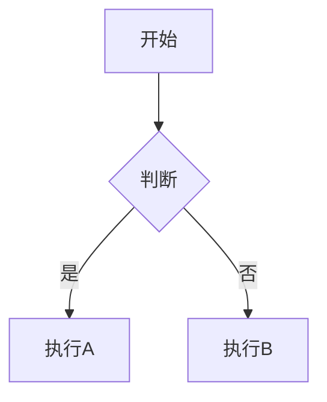

# Hugo Narrow 主题完整使用指南

## 🔧 已修复问题

### ✅ 问题1：首页菜单栏出现 "Getting started、Customization、FAQ、Basic Elements"

**问题原因**：
这些是示例文档页面，它们的 front matter 中设置了 `menu: main`，导致自动添加到主导航菜单。

**已修复**：
已禁用以下文件的主菜单显示：
- `content/docs/getting-started.md`
- `content/docs/customization.md`
- `content/docs/faq.md`

**如何避免类似问题**：
创建新页面时，如果不想显示在导航栏，不要添加 `menu: main` 配置。

---

## 📱 手机端首页优化（已直接修改）

### CSS 优化方案（推荐）

创建 `assets/css/custom.css` 文件：

```css
/* ==========================================
   移动端首页文章列表优化
   ========================================== */

@media (max-width: 768px) {
  /* 1. 隐藏首页文章卡片的移动端封面图 */
  body.home .post-list article > a > div > div:first-child {
    display: none !important;
  }
  
  /* 2. 让整个文章列表容器更窄 */
  body.home .post-list {
    max-width: 90%;
    margin-left: auto;
    margin-right: auto;
  }
  
  /* 3. 减少卡片内边距 */
  body.home .post-list article > a > div {
    padding: 1rem !important;
  }
  
  /* 4. 减少标题字体大小 */
  body.home .post-list article h3 {
    font-size: 1rem !important;
    margin-bottom: 0.75rem !important;
    line-height: 1.4 !important;
  }
  
  /* 5. 减少摘要字体大小 */
  body.home .post-list article p {
    font-size: 0.875rem !important;
    line-height: 1.5 !important;
    margin-bottom: 0.75rem !important;
  }
  
  /* 6. 减少元信息字体大小 */
  body.home .post-list article .text-sm {
    font-size: 0.75rem !important;
  }
  
  /* 7. 减少卡片之间的间距 */
  body.home .post-list .space-y-4 > * + * {
    margin-top: 0.75rem !important;
  }
  
  /* 8. 优化标签显示 */
  body.home .post-list article .bg-muted\/50 {
    font-size: 0.7rem !important;
    padding: 0.25rem 0.5rem !important;
  }
}

/* 如果想要更窄的卡片，调整这个值 */
@media (max-width: 768px) {
  body.home .post-list {
    max-width: 85%;  /* 可以改成 80% 或 75% */
  }
}
```

**启用方法**：
在 `config/_default/params.yaml` 中确保有以下配置（可能需要添加）：

```yaml
# 如果没有这个配置，添加到文件末尾
customCSS:
  - "css/custom.css"
```

---

## 📝 Post vs Project 的区别和使用建议

### Post（文章/博客）
**用途**：
- 📰 日常博客文章
- 📖 技术教程
- 💭 个人想法和笔记
- 📅 按时间排序的内容

**特点**：
- 显示发布日期
- 支持分类和标签
- 按时间倒序排列
- 适合频繁更新

**创建方式**：
```bash
hugo new posts/my-article.md
```

**Front Matter 示例**：
```yaml
---
title: "我的第一篇博客"
date: 2025-01-28
draft: false
description: "这是一篇关于..."
summary: "文章摘要"
tags: ["技术", "Hugo"]
categories: ["博客"]
cover: "images/cover.jpg"
---
```

---

### Project（项目/作品集）
**用途**：
- 💼 个人项目展示
- 🎨 作品集
- 🚀 开源项目
- 📱 应用介绍

**特点**：
- 卡片式展示（更视觉化）
- 可以添加项目链接、GitHub 链接
- 支持技术栈标签
- 适合长期展示

**创建方式**：
```bash
hugo new --kind projects projects/my-project.md
```

**Front Matter 示例**：
```yaml
---
title: "我的项目名称"
date: 2025-01-28
draft: false
description: "项目简介"
cover: "images/project-cover.jpg"
tags: ["React", "Node.js"]
# 项目特有字段
demo: "https://demo.example.com"
source: "https://github.com/username/project"
status: "completed"  # completed, in_progress, planning
tech_stack:
  - "React"
  - "TypeScript"
  - "Tailwind CSS"
---
```

---

### 使用建议

#### 1️⃣ **博客作者**（主要写文章）
```yaml
# 首页配置建议
home:
  contentOrder:
    - author-section      # 作者介绍
    - recent-posts        # 最近文章
    - page-content        # 首页内容
```

推荐目录结构：
```
content/
├── posts/           # 主要内容
│   ├── tech/       # 技术文章
│   ├── life/       # 生活随笔
│   └── tutorials/  # 教程
├── about/          # 关于页面
└── archives/       # 归档页面
```

#### 2️⃣ **开发者/设计师**（展示作品）
```yaml
# 首页配置建议
home:
  contentOrder:
    - author-section       # 个人介绍
    - featured-projects   # 精选项目
    - recent-posts        # 最新文章
```

推荐目录结构：
```
content/
├── projects/        # 主要展示项目
│   ├── web-apps/
│   ├── mobile-apps/
│   └── open-source/
├── posts/          # 技术博客
└── about/          # 关于我
```

#### 3️⃣ **混合型**（文章+项目）
```yaml
# 首页配置建议
home:
  contentOrder:
    - author-section
    - featured-projects
    - recent-posts
```

---

## 🎯 实用功能推荐

### 1. 系列文章（Series）
适合写教程或连载内容。

**使用方法**：
在文章的 front matter 中添加：
```yaml
series: ["Hugo 入门教程"]
```

同一系列的文章会自动关联，显示上一篇/下一篇。

---

### 2. 目录导航（TOC）
长文章自动生成目录。

**配置**（已在 params.yaml 中）：
```yaml
toc:
  enabled: true
  position: "left"  # left, right, card
```

文章中使用标题即可：
```markdown
## 第一部分
### 小节 1.1
### 小节 1.2
## 第二部分
```

---

### 3. 代码高亮和折叠
代码块自动高亮，超过30行自动折叠。

**使用**：
````markdown
```python
def hello_world():
    print("Hello, World!")
```
````

**配置**（已在 params.yaml 中）：
```yaml
codeblock:
  collapse:
    enabled: true
    autoCollapseLines: 30
```

---

### 4. 数学公式（KaTeX）
写技术文章时插入数学公式。

**已启用**，直接使用：
```markdown
行内公式：$E = mc^2$

块级公式：
$$
\int_{a}^{b} f(x) dx
$$
```

---

### 5. 图表（Mermaid）
插入流程图、序列图等。

**使用**：
````markdown

````

---

### 6. 标签和分类系统
帮助组织内容。

**推荐用法**：
- **Categories**（分类）：大的主题分类，如"技术"、"生活"、"摄影"
- **Tags**（标签）：具体的关键词，如"Python"、"React"、"旅行"

```yaml
categories: ["技术"]
tags: ["Python", "数据分析", "Pandas"]
```

---

### 7. 相关文章推荐
文章底部自动显示相关文章。

**配置**（已在 params.yaml 中）：
```yaml
post:
  showRelated: true
  relatedPostsCount: 3
```

---

### 8. 阅读进度条
显示文章阅读进度。

**配置**（已启用）：
```yaml
readingProgress:
  enabled: true
  height: 3
```

---

### 9. 主题和暗色模式
11种配色主题 + 自动暗色模式。

用户可以通过界面右上角切换：
- 🎨 主题样式切换器
- 🌓 亮色/暗色模式切换器

---

### 10. 搜索功能
全站内容搜索（如果导航栏有搜索图标）。

---

## 📁 推荐的内容组织结构

### 技术博客示例
```
content/
├── posts/
│   ├── frontend/
│   │   ├── react-hooks.md
│   │   └── css-tricks.md
│   ├── backend/
│   │   ├── nodejs-express.md
│   │   └── database-design.md
│   └── devops/
│       └── docker-tutorial.md
├── projects/
│   ├── my-blog/
│   │   └── index.md
│   └── todo-app/
│       └── index.md
├── about/
│   └── _index.md
└── archives/
    └── _index.md
```

### 个人博客示例
```
content/
├── posts/
│   ├── 2025/
│   │   ├── 01/
│   │   │   ├── new-year-goals.md
│   │   │   └── reading-notes.md
│   │   └── 02/
│   │       └── tech-learning.md
│   └── series/
│       └── hugo-tutorial/
│           ├── part1.md
│           ├── part2.md
│           └── part3.md
├── about/
└── links/  # 友情链接
```

---

## 🎨 实用技巧

### 1. 快速创建文章模板
修改 `archetypes/default.md`（已优化）：
```yaml
---
title: "{{ replace .File.ContentBaseName "-" " " | title }}"
date: {{ .Date }}
draft: true
description: ""
summary: ""
tags: []
categories: []
cover: ""
author: "Frida"
---

## 概述

## 正文

## 总结
```

### 2. 使用 Shortcodes
Hugo 提供了很多实用的短代码。

**示例**：
```markdown


```

### 3. 图片优化
使用 Page Bundles 组织图片：
```
posts/
└── my-article/
    ├── index.md
    ├── cover.jpg
    └── image1.png
```

引用：``

### 4. 草稿管理
写作中的文章：
```yaml
draft: true
```

预览草稿：
```bash
hugo server -D
```

### 5. 定时发布
设置未来日期：
```yaml
date: 2025-02-15T10:00:00+08:00
```

---

## 🚀 工作流建议

### 日常写作流程
```bash
# 1. 创建新文章
hugo new posts/my-new-post.md

# 2. 编辑内容
# 使用你喜欢的编辑器打开文件

# 3. 本地预览
hugo server -D

# 4. 完成后设置 draft: false

# 5. 构建发布
hugo
```

### 创建项目展示
```bash
# 1. 创建项目
hugo new projects/my-project/index.md

# 2. 添加项目图片到同一目录
# projects/my-project/cover.jpg

# 3. 编辑内容，添加项目信息
```

---

## 📌 常见问题解答

### Q1: 为什么我的修改没有生效？
A: 
1. 重启 Hugo 服务器（`Ctrl+C` 然后重新 `hugo server`）
2. 清除浏览器缓存（`Ctrl+Shift+R`）
3. 删除 `public/` 和 `resources/` 文件夹

### Q2: 如何添加评论系统？
A: 修改 `config/_default/params.yaml`：
```yaml
comments:
  enabled: true
  system: "giscus"  # 或其他系统
  giscus:
    repo: "your-username/your-repo"
    # ... 其他配置
```

### Q3: 如何自定义样式？
A: 创建 `assets/css/custom.css` 并添加自定义CSS。

### Q4: 首页内容顺序如何调整？
A: 修改 `params.yaml` 中的 `home.contentOrder`。

### Q5: 如何添加新页面到导航？
A: 在页面的 front matter 中添加：
```yaml
menu: main
```

---

## 🎁 额外建议

### 内容规划
- 📅 制定发布计划（如每周1-2篇）
- 🗂️ 使用分类和标签建立内容体系
- 📝 保持文章质量大于数量

### SEO 优化
- 填写完整的 `description` 和 `keywords`
- 使用语义化的标题结构（H2, H3）
- 添加 alt 文本到图片

### 性能优化
- 压缩图片（使用 WebP 或 AVIF 格式）
- 使用 CDN 加速
- 启用缓存（已默认启用）

### 社交分享
- 设置合适的封面图（`cover`）
- 写好文章摘要（`summary`）
- 在 footer 添加社交链接

---

## 📞 需要帮助？

- 📖 查看主题文档：`/docs/` 目录
- 🐛 遇到问题：检查 Hugo 日志输出
- 💡 获取灵感：浏览其他使用该主题的网站

祝你使用愉快！🎉
