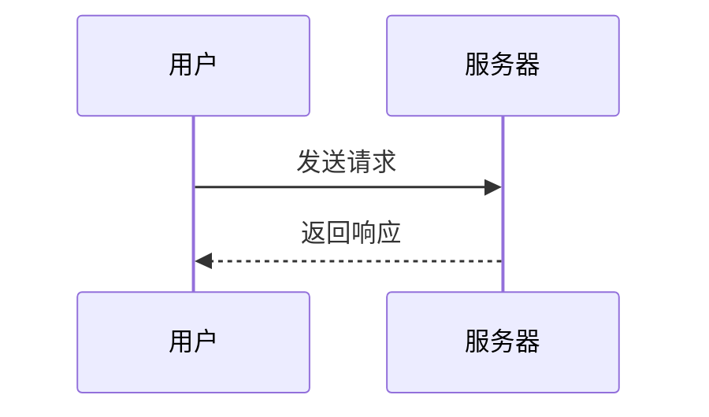
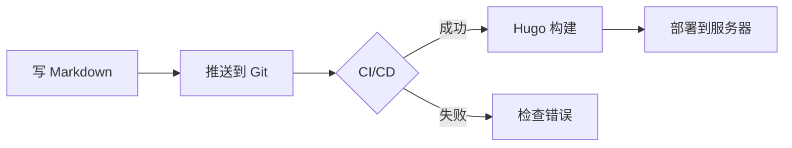
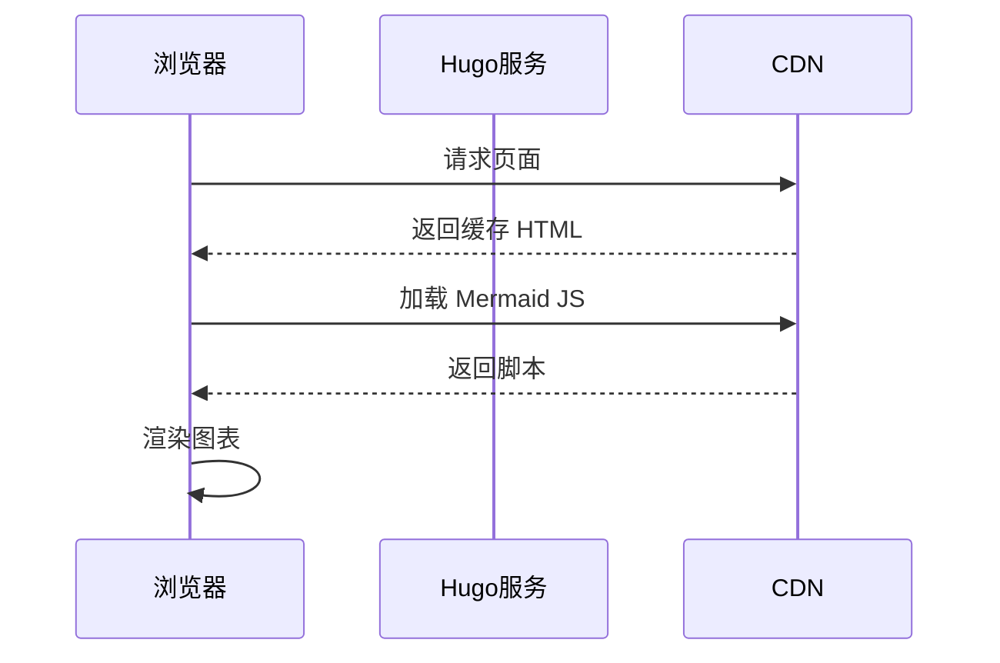
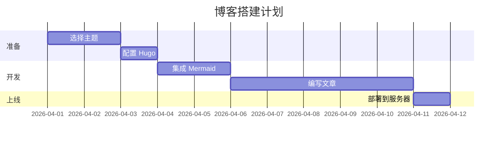
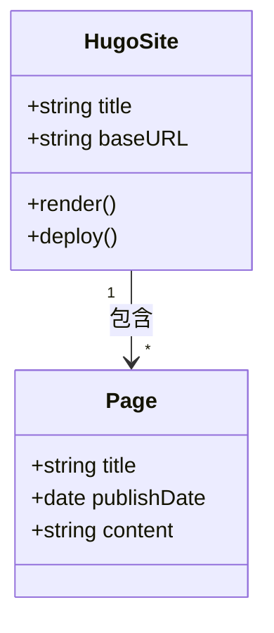

## 什么是 Mermaid？

[Mermaid](https://mermaid.js.org/) 是一个基于 JavaScript 的图表工具，允许你用类 Markdown 的文本语法来描述和渲染各类图表，包括流程图、时序图、类图、甘特图等。

---

## Hugo 集成 Mermaid 的几种方式

### 方式一：使用 Shortcode（推荐）

在 `layouts/shortcodes/` 目录下创建 `mermaid.html`：

```html
<!-- layouts/shortcodes/mermaid.html -->
<div class="mermaid">
  {{- .Inner | safeHTML }}
</div>
```

然后在页面底部或主题的 `layouts/partials/footer.html` 中引入 Mermaid JS：

```html
<script src="https://cdn.jsdelivr.net/npm/mermaid/dist/mermaid.min.js"></script>
<script>
  mermaid.initialize({ startOnLoad: true, theme: 'default' });
</script>
```

在文章中这样使用：

```

graph TD
    A[开始] --> B{判断}
    B -->|是| C[执行操作]
    B -->|否| D[结束]

```

---

### 方式二：使用代码块 + 自定义 JS（Hugo 0.93+）

Hugo 0.93 起支持 [Goldmark 代码块钩子](https://gohugo.io/content-management/syntax-highlighting/)，可以拦截 `mermaid` 语言的代码块。

在 `layouts/_default/_markup/render-codeblock-mermaid.html` 中创建：

```html
<div class="mermaid">
  {{- .Inner | safeHTML }}
</div>
{{ .Page.Store.Set "hasMermaid" true }}
```

在页面模板末尾（如 `layouts/_default/baseof.html`）按需加载 JS：

```html
{{ if .Store.Get "hasMermaid" }}
  <script src="https://cdn.jsdelivr.net/npm/mermaid/dist/mermaid.min.js"></script>
  <script>mermaid.initialize({ startOnLoad: true });</script>
{{ end }}
```

这样文章中直接用标准 Markdown 代码块即可：

````

````

---

### 方式三：使用主题内置支持

部分 Hugo 主题（如 **PaperMod**、**DoIt**、**Stack**）已内置 Mermaid 支持，只需在 `config.yaml` 中开启：

```yaml
# config.yaml（以 PaperMod 为例）
params:
  mermaid:
    enable: true
    theme: "default"   # 可选 default / dark / neutral / forest
```

---

## 常用图表示例

### 流程图



### 时序图



### 甘特图



### 类图



---

## 注意事项

1. **转义问题**：在 Shortcode 内部，避免使用 `{}` 以防与 Hugo 模板语法冲突。
2. **按需加载**：推荐使用方式二的按需加载，避免每个页面都引入 Mermaid JS 影响性能。
3. **主题适配**：暗色主题下可将 `theme` 设置为 `dark`，或使用 CSS 变量自定义颜色。
4. **版本锁定**：生产环境建议锁定 Mermaid 版本号，如 `mermaid@10.9.0`，防止上游更新破坏样式。

---

## 总结

| 方式 | 适用场景 | 优点 |
|------|----------|------|
| Shortcode | 任意版本 Hugo | 灵活，兼容性好 |
| 代码块钩子 | Hugo 0.93+ | 标准语法，按需加载 |
| 主题内置 | 使用支持的主题 | 零配置 |

推荐优先使用**代码块钩子**方式，语法最接近标准 Markdown，迁移成本低，且支持按需加载脚本，对页面性能友好。
